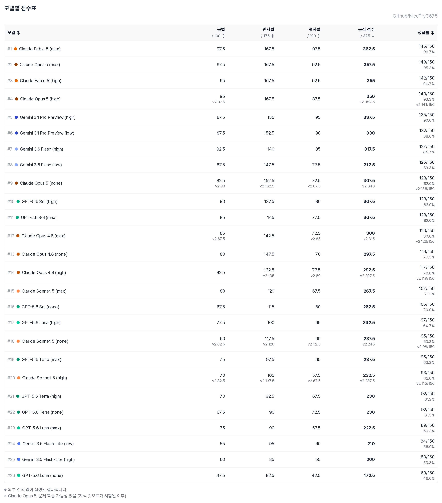
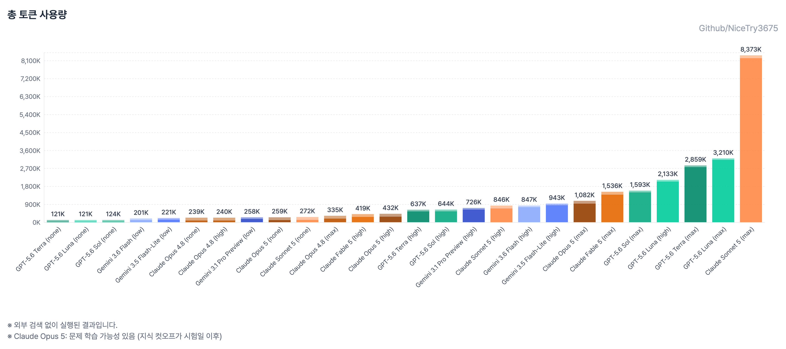

# 15th Korean Bar Examination — LLM Solving Records

[](https://opensource.org/licenses/MIT)
[](https://www.python.org/downloads/)

**한국어: [readme.md](readme.md)**

<div align="center">

### [**Interactive Dashboard**](https://nicetry3675.github.io/korean-bar-exam-llm/)

[](https://nicetry3675.github.io/korean-bar-exam-llm/)

**Per-model scores, per-subject accuracy, and cost analysis**

</div>

---

## Overview

Results of various LLMs solving the **multiple-choice section of the 15th Korean Bar
Examination** (Public Law 40 questions, Civil Law 70, Criminal Law 40 — 150 questions,
375 points total, 2.5 points per question).

Ten models were run at **different reasoning efforts, for 27 combinations
in total**. The goal is to show how much the same model's score moves with its
reasoning budget, and what that costs.

**Reasoning effort** is the thinking-budget setting passed with each API call: none
disables reasoning, and low → high → max allow progressively more thinking tokens
before the answer. In the charts below, **high-reasoning** groups the max·high runs and
**low-reasoning** groups the none·low runs. Gemini uses a different budget scheme
(thinking_level), so it was run at two levels, low and high.

> This benchmark covers **only the multiple-choice section**, so it cannot be used to
> determine whether a candidate would pass the examination.

---

## Overall Results

**High reasoning (max·high)**


**Low reasoning (none·low)**


**Cost vs performance**

The x-axis is the API-equivalent cost of solving all 150 questions; the y-axis is the
total score. Points joined by a dashed line are the same model at different reasoning
levels (none · low · high · max).


The upper-left quadrant (high score, low cost) is the favourable one. Moving right means
paying more for the same score, and a dashed line that stretches far to the right without
rising is a model whose score does not follow its reasoning budget.

**Score table by model**



**Token usage**



> The score table is exported from the dashboard, so its labels are in Korean:
> 공법 = Public Law, 민사법 = Civil Law, 형사법 = Criminal Law, 공식 점수 = official
> score, 정답률 = accuracy.
>
> **145/150** on the right of the score table is the number of correct answers. Questions
> where no answer could be extracted score zero; causes are broken down in
> [When no answer was obtained](#when-no-answer-was-obtained).
>
> The **v2** figures are a parallel notation that also credits answers which broke the
> required format. Official scores are v1 — see
> [Official score (v1) and parallel notation (v2)](#official-score-v1-and-parallel-notation-v2).
>
> **API-equivalent cost** is not a subscription bill. It applies public API list prices
> to the measured token usage, so it differs from what was actually charged.
>
> The dashed line in the charts marks **247.5 points**: the multiple-choice score that
> corresponds to the pass line when the essay score is average (99 questions correct).
> It is a reference point for where a human candidate sits, and it is **66.0** on the
> 100-point scale.

Per-subject score charts, the per-question answer heatmap, and the cost table are not
included in this document. They are available in the
[interactive dashboard](https://nicetry3675.github.io/korean-bar-exam-llm/), and the same
numbers ship in the workbook `제15회 변호사시험 LLM 풀이.xlsx`.

---

## Key Findings

1. **Fable 5 wins under every condition.** 362.5 at max (96.7%), and still 355 at high
   for one-fifth the cost ($15.31).
2. **Opus 5 is a generational jump.** At the same max effort it beats Opus 4.8 (300) by
   **+57.5 points**, at one-third the cost of Fable max.
3. **Opus 4.8 is nearly effort-insensitive.** none 297.5 / high 292.5 / max 300 — a
   spread of just 7.5 points, all for $3–6. **Non-thinking beats high.**
4. **Sonnet 5 at max is pathological overthinking.** 8.23M output tokens (55K per
   question average) and $123.91 for 267.5 points. 18 questions burned the full 128K
   output limit without producing an answer. It is the only one of the three Anthropic
   models where more thinking backfired.
5. **Sol is effort-insensitive.** max and high tie at 307.5 while costing 2.7× more
   ($45.69 vs $17.19).
6. **Luna depends on reasoning the most:** none 172.5 → high 242.5, a +70 swing.
7. **Flash-Lite scores higher at low than at high** (210 vs 200) — a miniature of the
   Sonnet max pattern, where more thinking hurts a smaller model.
8. **Best value: Gemini 3.6 Flash (low)** — 312.5 points for $1.03, or $0.0033 per point.
   It outscores Sol max (307.5, $45.69) at 1/44 the cost.

---

## Scoring

### Official score (v1) and parallel notation (v2)

The prompt instructs each model to end its response with `정답: N`.
**Official scores come from a strict parser (v1) that accepts only that format**,
because following the required format is treated as part of the skill being measured.

Some responses reached the right answer but broke the format, so results from a lenient
parser (v2) that also recognizes prose phrasing are recorded **alongside** in the
workbook. v2 is reference-only: it does not feed the official scores, the dashboard, or
the table above.

A real example — Sonnet 5 (high)'s response to Civil Law question 1 ends like this:

> … Therefore the correct statements are **ㄱ, ㄴ, ㄷ**, and the answer is **③**.
> (original Korean: "따라서 옳은 지문은 **ㄱ, ㄴ, ㄷ**이며, 정답은 **③**입니다.")

The answer (③) is right, but the last line is not in the `정답: 3` format, so v1 marks
it `parse_failed` (0 points) while v2 extracts ③ from the prose and counts it as
correct. Sonnet 5 (high) had 31 such format violations, 22 of them with the right
answer — which accounts for the entire +55.0 v1/v2 gap below (22 × 2.5).

| Model | v1 (official) | v2 (reference) | Delta |
|---|---|---|---|
| Claude Sonnet 5 (high) | 232.5 | 287.5 | +55.0 |
| Claude Opus 5 (none) | 307.5 | 340.0 | +32.5 |
| Claude Opus 4.8 (max) | 300.0 | 315.0 | +15.0 |
| Claude Sonnet 5 (none) | 237.5 | 245.0 | +7.5 |
| Claude Opus 4.8 (high) | 292.5 | 297.5 | +5.0 |
| Claude Opus 5 (high) | 350.0 | 352.5 | +2.5 |

The other 21 combinations score identically under v1 and v2. Format violations where
the right answer was written in prose — **the kind v2 can recover** — occurred only in
the Anthropic models. The OpenAI `parse_failed` cases (Luna none, 5 questions) are a
different animal: in all five the model **refused to pick a number**, arguing that none
of the choices could be right, and ended with `정답: 없음` ("no answer") or `N`. With no
number offered there was nothing for v2 to recover (in Criminal Law 15 it did scrape a ③
out of the prose, but that is not the correct answer (⑤), so the score was the same). The
Google models had zero format violations.

### When no answer was obtained

| Type | Affected | Cause |
|---|---|---|
| `parse_failed` | Sonnet 5 (high) 31, Opus 5 (none) 13, Opus 4.8 (max) 7, Luna (none) 5, Sonnet 5 (none) 4, Opus 4.8 (high) 3, Opus 4.8 (none) 1, Opus 5 (high) 1, Fable 5 (low) 1 | Answered, but not in the required format (partly recovered under v2) |
| `no_answer` | Sonnet 5 (max) 18 | Exhausted the 128K output limit without producing an answer |
| `no_answer` | Luna (max) 25, Terra (max) 3 | No response received — ChatGPT Codex backend stream lifetime limit |

All are scored as zero. The Luna/Terra stream truncations did not recover on retry;
neither `service_tier: "priority"` (accepted but ineffective) nor background mode
(rejected with 400 `Store must be set to false`) worked around them.

---

## Test Environment and Caveats

**Important: this experiment mostly ran over subscription OAuth, not public API keys.**

- **Anthropic / OpenAI models**: OAuth credentials from Claude and ChatGPT subscriptions
- **Gemini models**: Google API key
- **Reasoning setting**: explicitly set per run to none / high / max (low / high for Gemini)
- **System prompt**: none beyond the benchmark instruction
- **External tools**: **not provided** (no search, no calculator)
- **Question delivery**: text extracted from the Ministry of Justice's public HWP files,
  sent as a single user message per question
- **Retries**: only when a request errored without a response. Malformed responses were
  scored as incorrect rather than retried.

Subscription OAuth paths use consumer accounts and private transports. Automated
benchmarking over them may violate terms of service and lead to rate limiting or account
suspension. **These results may therefore differ from calling the same models over the
public API.**

Generation parameters such as temperature were left at their defaults, so repeated runs
will vary somewhat.

---

## Running It

Question text and the source HWP files are not included in this repository for copyright
reasons. For the answer key, scoring, provenance, local conversion, and the dry-run
procedure, see the [benchmark guide](benchmarks/bar-exam-15/README.md).

```bash
# 1. Convert the public HWP files into the local, git-ignored problems/ tree
python3 scripts/prepare_bar_exam.py

# 2. Prepare model config (records env-var names or oauth_profile, never secret values)
cp benchmark_models.example.json benchmark_models.json

# 3. Preview — the default is a dry run with no network access
python3 benchmark_runner.py --benchmark bar-exam-15 \
  --config benchmark_models.json --run-mode question

# 4. Real execution requires an explicit flag and a cap
python3 benchmark_runner.py --benchmark bar-exam-15 \
  --config benchmark_models.json --run-mode question \
  --execute --max-requests 150

# 5. After review, sync the workbook and dashboard data
python3 sync_data.py --benchmark bar-exam-15 import --all
python3 sync_data.py --benchmark bar-exam-15 export --all-sheets --all-models
```

---

## Requesting the Raw Model Responses

The raw responses each model produced are not included in this repository — only the
graded results and aggregates are published — because of their size and the copyright
status of the quoted question text. If you need the raw responses for verification or
research, please get in touch at
[tomtom35177@gmail.com](mailto:tomtom35177@gmail.com).

---

## License and Copyright

### Project license

Distributed under the MIT license — see [LICENSE.md](LICENSE.md). This repository builds
on the benchmark dashboard and synchronization code from
[hehee9/2026-CSAT](https://github.com/hehee9/2026-CSAT), and retains its copyright notice.

### Exam content

- The 15th Korean Bar Examination questions and answer key are published by the
  **Ministry of Justice** of the Republic of Korea.
- That content is distributed under the
  [Korea Open Government License Type 1](https://www.kogl.or.kr/info/userGuide.do), which
  requires attribution. This content license is separate from the MIT license covering
  this repository's source code.
- This repository contains no original question text — only the answer key, scoring,
  provenance, and model results.
- Sources: [questions](https://www.moj.go.kr/bbs/moj/150/602397/artclView.do) ·
  [final answer key](https://www.moj.go.kr/bbs/moj/151/603464/artclView.do)
