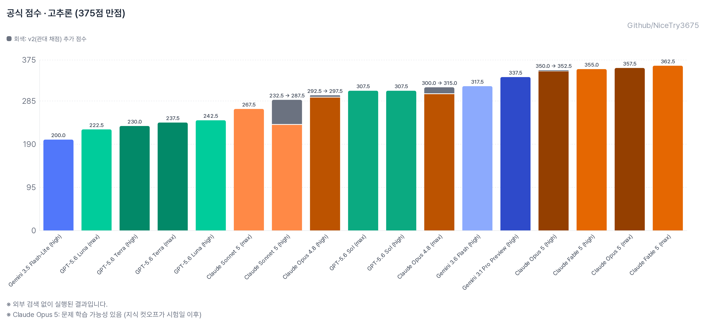
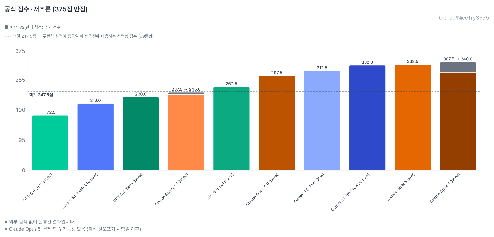
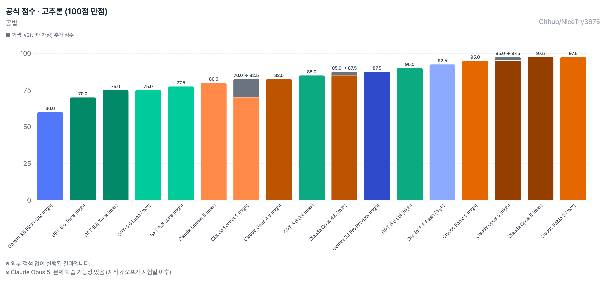
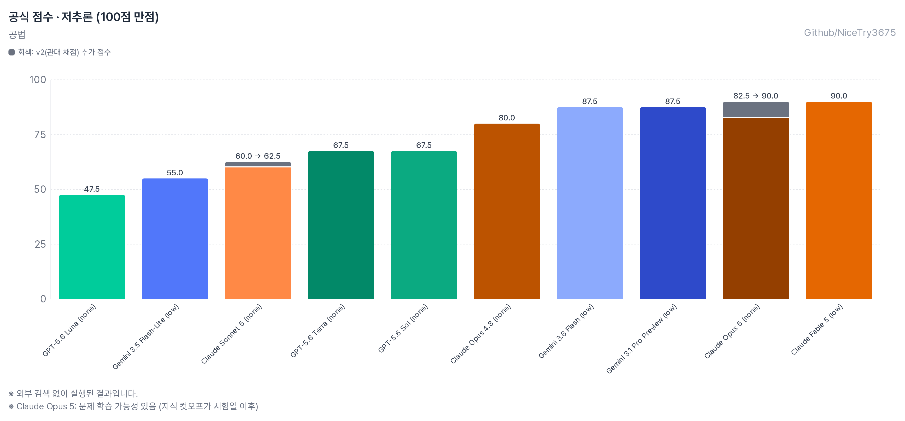
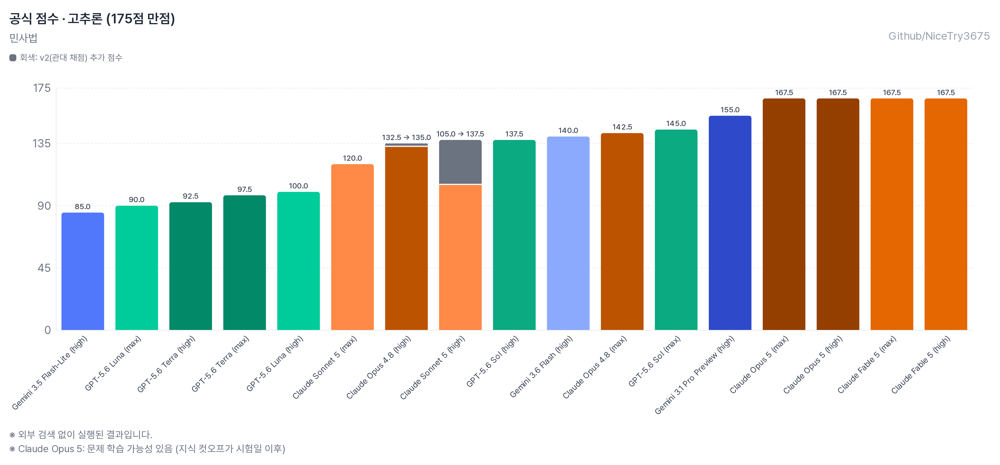
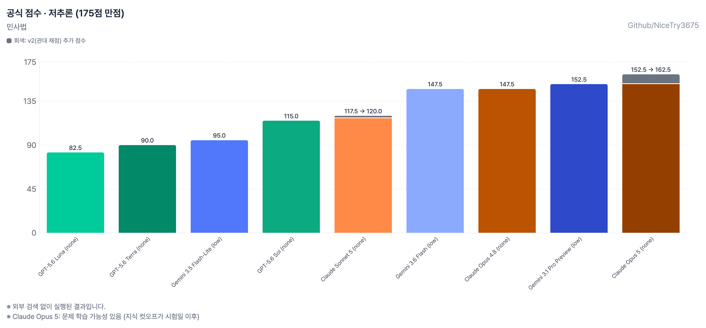
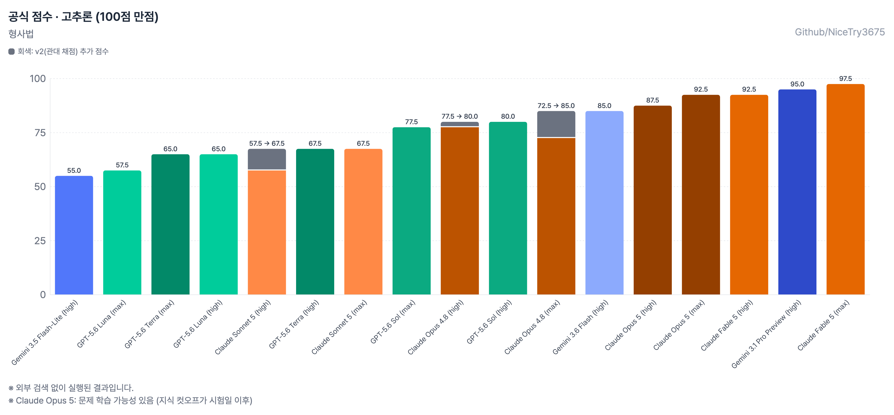
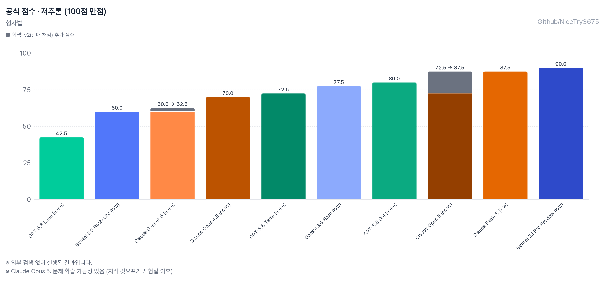
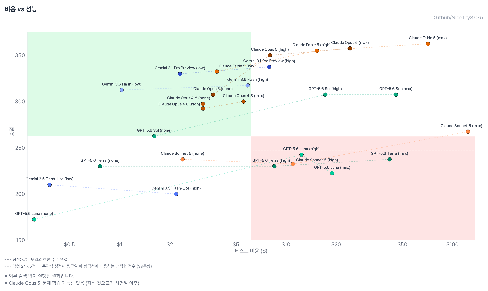

# 제15회 변호사시험 LLM 풀이 기록

[](https://opensource.org/licenses/MIT)
[](https://www.python.org/downloads/)

**English version: [README_en.md](README_en.md)**

<div align="center">

### [**Interactive Dashboard**](https://nicetry3675.github.io/korean-bar-exam-llm/)

[](https://nicetry3675.github.io/korean-bar-exam-llm/)

**모델별 점수, 과목별 정답률, 비용 분석을 대시보드에서 확인하실 수 있습니다**

</div>

---

## 개요

다양한 LLM이 **제15회 변호사시험 선택형**(공법 40문항, 민사법 70문항, 형사법 40문항 ·
총 150문항 375점, 문항당 2.5점)을 푼 결과입니다.

10개 모델을 **추론 강도별로 나눠 27개 조합**을 실행했습니다. 같은 모델이라도
추론 예산에 따라 점수가 얼마나 달라지는지, 그리고 그 대가로 얼마를 쓰는지를 함께 봅니다.

**추론 강도**는 API 호출 때 지정하는 사고(thinking) 예산 설정입니다. none은 추론
비활성이고, low → high → max 순으로 답을 내기 전에 쓸 수 있는 사고 토큰이
늘어납니다. 아래 그래프의 **고추론**은 max·high, **저추론**은 none·low 실행을 묶은
것입니다. Gemini는 예산 단계 체계(thinking_level)가 달라 low/high 두 수준으로
실행했습니다.

> 이 벤치마크는 변호사시험 중 **선택형만** 다루므로 합격 여부를 산출하는 용도로 쓸 수 없습니다.

---

## 종합 성적

**고추론 (max·high)**



**저추론 (none·low)**



| 모델 | 공법 | 민사법 | 형사법 | 총점 | 100점 환산 | 응답 | API 환산 비용 | 출력 토큰 |
|---|---|---|---|---|---|---|---|---|
| Claude Fable 5 (max) | 97.5 | 167.5 | 97.5 | **362.5** | 96.7 | 150/150 | $71.13 | 1.39M |
| Claude Opus 5 (max) | 97.5 | 167.5 | 92.5 | **357.5** | 95.3 | 150/150 | $24.23 | 941K |
| Claude Fable 5 (high) | 95 | 167.5 | 92.5 | **355** | 94.7 | 150/150 | $15.31 | 278K |
| Claude Opus 5 (high) | 95 | 167.5 | 87.5 | **350** | 93.3 | 149/150 | $7.99 | 291K |
| Gemini 3.1 Pro Preview (high) | 87.5 | 155 | 95 | **337.5** | 90.0 | 150/150 | $7.91 | 646K |
| Claude Fable 5 (low) | 90 | 155 | 87.5 | **332.5** | 88.7 | 149/150 | $3.84 | 49K |
| Gemini 3.1 Pro Preview (low) | 87.5 | 152.5 | 90 | **330** | 88.0 | 150/150 | $2.30 | 179K |
| Gemini 3.6 Flash (high) | 92.5 | 140 | 85 | **317.5** | 84.7 | 150/150 | $5.88 | 768K |
| Gemini 3.6 Flash (low) | 87.5 | 147.5 | 77.5 | **312.5** | 83.3 | 150/150 | $1.03 | 121K |
| Claude Opus 5 (none) | 82.5 | 152.5 | 72.5 | **307.5** | 82.0 | 137/150 | $3.64 | 118K |
| GPT-5.6 Sol (high) | 90 | 137.5 | 80 | **307.5** | 82.0 | 150/150 | $17.19 | 559K |
| GPT-5.6 Sol (max) | 85 | 145 | 77.5 | **307.5** | 82.0 | 150/150 | $45.69 | 1.51M |
| Claude Opus 4.8 (max) | 85 | 142.5 | 72.5 | **300** | 80.0 | 143/150 | $5.55 | 194K |
| Claude Opus 4.8 (none) | 80 | 147.5 | 70 | **297.5** | 79.3 | 149/150 | $3.16 | 98K |
| Claude Opus 4.8 (high) | 82.5 | 132.5 | 77.5 | **292.5** | 78.0 | 147/150 | $3.17 | 99K |
| Claude Sonnet 5 (max) | 80 | 120 | 67.5 | **267.5** | 71.3 | 132/150 | $123.91 | 8.23M |
| GPT-5.6 Sol (none) | 67.5 | 115 | 80 | **262.5** | 70.0 | 150/150 | $1.61 | 40K |
| GPT-5.6 Luna (high) | 77.5 | 100 | 65 | **242.5** | 64.7 | 150/150 | $12.37 | 2.05M |
| Claude Sonnet 5 (none) | 60 | 117.5 | 60 | **237.5** | 63.3 | 146/150 | $2.39 | 131K |
| GPT-5.6 Terra (max) | 75 | 97.5 | 65 | **237.5** | 63.3 | 147/150 | $41.85 | 2.78M |
| Claude Sonnet 5 (high) | 70 | 105 | 57.5 | **232.5** | 62.0 | 119/150 | $10.99 | 705K |
| GPT-5.6 Terra (high) | 70 | 92.5 | 67.5 | **230** | 61.3 | 150/150 | $8.50 | 553K |
| GPT-5.6 Terra (none) | 67.5 | 90 | 72.5 | **230** | 61.3 | 150/150 | $0.76 | 37K |
| GPT-5.6 Luna (max) | 75 | 90 | 57.5 | **222.5** | 59.3 | 125/150 | $18.91 | 3.14M |
| Gemini 3.5 Flash-Lite (low) | 55 | 95 | 60 | **210** | 56.0 | 150/150 | $0.38 | 142K |
| Gemini 3.5 Flash-Lite (high) | 60 | 85 | 55 | **200** | 53.3 | 150/150 | $2.18 | 864K |
| GPT-5.6 Luna (none) | 47.5 | 82.5 | 42.5 | **172.5** | 46.0 | 145/150 | $0.31 | 37K |

> **응답** 열은 답을 추출할 수 있었던 문항 수입니다. 나머지는 0점 처리되며,
> 원인은 [응답을 얻지 못한 경우](#응답을-얻지-못한-경우)에 정리했습니다.
>
> **API 환산 비용**은 구독 요금이 아니라 공개 API 단가를 토큰 사용량에 적용한
> 추정치입니다. 실제 청구액과 다릅니다.
>
> **100점 환산**은 총점을 375점 만점에서 100점 만점으로 바꾼 값입니다. 문항당 배점이
> 2.5점으로 균일하므로 정답률과 같은 수치입니다.
>
> 그래프의 점선은 **객컷 247.5점**입니다. 주관식 성적이 평균일 때 합격선에 대응하는
> 선택형 점수(99문항)로, 사람 수험생의 기준점을 가늠하기 위한 참고선입니다.
> 100점 환산으로는 **66.0점**입니다.

### 과목별

**공법 · 고추론**



**공법 · 저추론**



**민사법 · 고추론**



**민사법 · 저추론**



**형사법 · 고추론**



**형사법 · 저추론**



### 비용 대비 성능

가로축은 150문항을 모두 푸는 데 든 API 환산 비용, 세로축은 총점입니다.
점선으로 이어진 점들은 같은 모델의 추론 수준(none·low·high·max)을 나타냅니다.



왼쪽 위(고성능·저비용)가 유리한 영역입니다. 오른쪽으로 갈수록 같은 점수에 더 많은
비용을 쓴 것이고, 점선이 오른쪽으로 길게 뻗으면서 위로 오르지 않는 모델은 추론 예산을
늘려도 점수가 따라오지 않는 경우입니다.

---

## 주요 발견

1. **Fable 5가 모든 조건에서 1위.** max 362.5점(96.7%)이고, high로 낮춰도 355점을
   비용 1/5($15.31)에 냅니다.
2. **Opus 5는 세대 도약.** 같은 max 조건에서 Opus 4.8(300점)보다 **+57.5점**,
   비용은 Fable max의 1/3입니다.
3. **Opus 4.8은 추론 강도에 거의 무반응.** none 297.5 / high 292.5 / max 300으로
   폭이 7.5점뿐이고 비용은 전부 $3~6입니다. **비추론이 high보다 높습니다.**
4. **Sonnet 5 max는 병리적 overthinking.** 출력 8.23M 토큰(문항 평균 55K)에
   $123.91을 쓰고도 267.5점입니다. 18문항은 128K 출력 한도를 다 태우고도 답을
   내지 못했습니다. 세 Anthropic 모델 중 유일하게 추론 확대가 역효과였습니다.
5. **Sol은 추론 강도에 무반응.** max와 high가 307.5점 동점인데 비용은 2.7배
   차이($45.69 vs $17.19)입니다.
6. **Luna는 추론 의존도가 가장 큼.** none 172.5 → high 242.5로 +70점입니다.
7. **Flash-Lite는 low가 high보다 높습니다**(210 vs 200). 소형 모델에서 추론 확대가
   역효과인 Sonnet max 패턴의 축소판입니다.
8. **가성비 1위는 Gemini 3.6 Flash (low)** — $1.03으로 312.5점, 점당 $0.0033입니다.
   Sol max(307.5점, $45.69)보다 높은 점수를 1/44 비용에 냅니다.

---

## 채점 방식

### 공식 점수(v1)와 병행 표기(v2)

프롬프트는 마지막 줄에 `정답: N` 형식으로 답을 쓰도록 지시합니다.
**공식 점수는 이 형식을 지킨 응답만 인정하는 strict 파서(v1)로 채점합니다.**
형식 준수도 실력의 일부로 보기 때문입니다.

다만 형식을 어겼을 뿐 정답을 맞힌 응답이 있어, 산문 표현까지 인식하는 관대한
파서(v2) 결과를 워크북에 **병행 표기**합니다. v2는 참고용이며 공식 점수·대시보드·
위 표에는 반영하지 않습니다.

실제 사례 — Sonnet 5 (high)의 민사법 1번 응답은 이렇게 끝납니다.

> … 따라서 옳은 지문은 **ㄱ, ㄴ, ㄷ**이며, 정답은 **③**입니다.

정답(③)은 맞혔지만 마지막 줄이 `정답: 3` 형식이 아니므로 v1은 `parse_failed`
(0점)로 처리하고, v2는 산문에서 ③을 추출해 정답으로 인정합니다. Sonnet 5 (high)는
이런 형식 위반이 31건이었고 그중 22건이 정답이어서, 아래 표의 v1/v2 격차
+55.0점(= 22 × 2.5)이 전부 여기서 나왔습니다.

| 모델 | v1 (공식) | v2 (참고) | 차이 |
|---|---|---|---|
| Claude Sonnet 5 (high) | 232.5 | 287.5 | +55.0 |
| Claude Opus 5 (none) | 307.5 | 340.0 | +32.5 |
| Claude Opus 4.8 (max) | 300.0 | 315.0 | +15.0 |
| Claude Sonnet 5 (none) | 237.5 | 245.0 | +7.5 |
| Claude Opus 4.8 (high) | 292.5 | 297.5 | +5.0 |
| Claude Opus 5 (high) | 350.0 | 352.5 | +2.5 |

나머지 21개 조합은 v1과 v2 점수가 같습니다. 정답을 산문으로 적어 **v2로 점수가
복원되는 형식 위반은 Anthropic 계열에서만** 발생했습니다. OpenAI 쪽 `parse_failed`
(Luna none 5건)는 v2로도 답을 추출하지 못했거나 추출해도 오답이라 점수 차이가
없었고, Google 계열은 형식 위반 자체가 0건이었습니다.

### 응답을 얻지 못한 경우

| 유형 | 대상 | 원인 |
|---|---|---|
| `parse_failed` | Sonnet 5 (high) 31, Opus 5 (none) 13, Opus 4.8 (max) 7, Luna (none) 5, Sonnet 5 (none) 4, Opus 4.8 (high) 3, Opus 4.8 (none) 1, Opus 5 (high) 1, Fable 5 (low) 1 | 답은 냈지만 지정 형식을 지키지 않음 (v2에서 일부 복원) |
| `no_answer` | Sonnet 5 (max) 18 | 128K 출력 한도를 모두 소진하고도 답 미도출 |
| `no_answer` | Luna (max) 25, Terra (max) 3 | ChatGPT Codex 백엔드의 스트림 수명 한도로 응답 미수신 |

모두 0점 처리했습니다. Luna/Terra의 스트림 절단은 재시도로 회복되지 않았고,
`service_tier: "priority"`(수락되나 무효)와 `background` 모드(400 `Store must be
set to false`) 모두 우회에 실패했습니다.

---

## 테스트 환경 및 주의사항

**중요: 이 실험은 공개 API 키가 아니라 대부분 구독 계정의 OAuth 경로로 진행했습니다.**

- **Anthropic / OpenAI 모델**: Claude·ChatGPT 구독 계정의 OAuth credential 사용
- **Gemini 모델**: Google API 키 사용
- **추론 설정**: 모델별로 none / high / max(Gemini는 low / high)를 명시 지정
- **시스템 프롬프트**: 벤치마크 지시문 외에 별도 프롬프트 없음
- **외부 도구**: 검색·계산기 등 **제공하지 않음**
- **문제 제공**: 법무부 공개 HWP에서 추출한 텍스트를 문항당 1개 user message로 전달
- **재시도**: 오류로 응답을 받지 못한 경우에만 재시도했고, 잘못된 형태의 응답은
  모두 오답 처리했습니다

구독 OAuth 경로는 각 서비스의 소비자용 계정과 비공개 transport를 사용합니다.
자동 벤치마크 실행은 서비스 약관 위반, 사용 제한, 계정 정지로 이어질 수 있습니다.
따라서 **이 결과는 공개 API로 같은 모델을 호출한 결과와 다를 수 있습니다.**

또한 온도 등 생성 파라미터는 기본값이라 측정할 때마다 편차가 있을 수 있습니다.

---

## 실행 방법

문제 본문과 원본 HWP는 저작권 문제로 저장소에 포함하지 않습니다. 정답·배점·출처와
로컬 변환 절차, dry-run 방법은 [벤치마크 안내](benchmarks/bar-exam-15/README.md)를
참고해 주세요.

```bash
# 1. 공개 HWP를 로컬 problems/ 트리로 변환
python3 scripts/prepare_bar_exam.py

# 2. 모델 설정 준비 (비밀키 값 대신 환경변수 이름 또는 oauth_profile만 기록)
cp benchmark_models.example.json benchmark_models.json

# 3. 미리보기 — 기본값은 네트워크 없는 dry-run
python3 benchmark_runner.py --benchmark bar-exam-15 \
  --config benchmark_models.json --run-mode question

# 4. 실제 실행은 명시적 플래그와 상한이 있을 때만 가능
python3 benchmark_runner.py --benchmark bar-exam-15 \
  --config benchmark_models.json --run-mode question \
  --execute --max-requests 150

# 5. 검토 후 워크북·대시보드 데이터 동기화
python3 sync_data.py --benchmark bar-exam-15 import --all
python3 sync_data.py --benchmark bar-exam-15 export --all-sheets --all-models
```

---

## 모델 응답 원본 문의

각 모델이 실제로 출력한 응답 원본은 용량과 저작권 문제로 저장소에 포함하지 않고,
채점 결과와 집계값만 공개합니다. 검증이나 연구 목적으로 원본이 필요하시면
[tomtom35177@gmail.com](mailto:tomtom35177@gmail.com)으로 문의해 주세요.

---

## 라이선스 및 저작권

### 프로젝트 라이선스

MIT 라이선스로 배포합니다. 자세한 내용은 [LICENSE.md](LICENSE.md)를 참고하세요.
이 저장소는 [hehee9/2026-CSAT](https://github.com/hehee9/2026-CSAT)의 벤치마크
대시보드·동기화 코드를 기반으로 하며, 원저작권 표시를 유지합니다.

### 시험 문제 저작권

- 제15회 변호사시험 문제와 정답은 **법무부**가 공개한 자료입니다.
- 법무부 게시물의 시험 콘텐츠는 [공공누리 제1유형](https://www.kogl.or.kr/info/userGuide.do)에
  따라 출처 표시가 필요하며, 이 이용조건은 저장소 소스 코드의 MIT 라이선스와 별개입니다.
- 이 저장소는 문제 원본을 포함하지 않고 **정답·배점·출처와 모델 응답 결과**만 담습니다.
- 출처: [문제](https://www.moj.go.kr/bbs/moj/150/602397/artclView.do) ·
  [최종정답](https://www.moj.go.kr/bbs/moj/151/603464/artclView.do)
